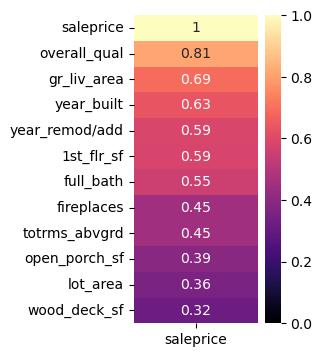
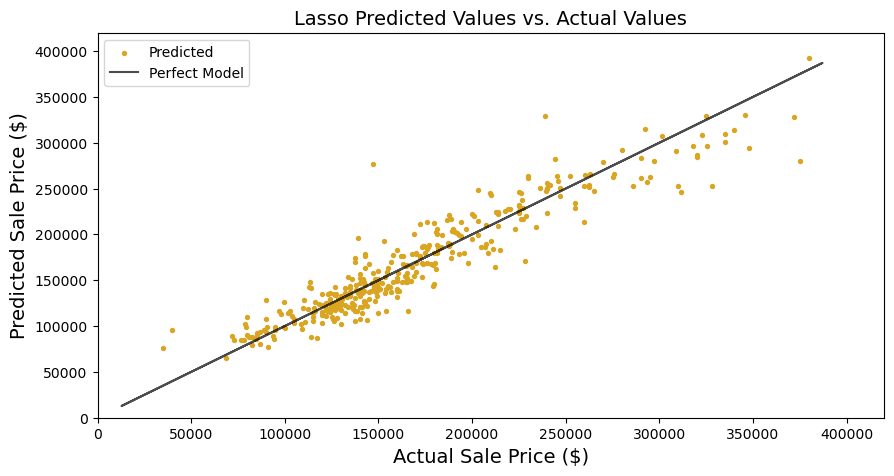
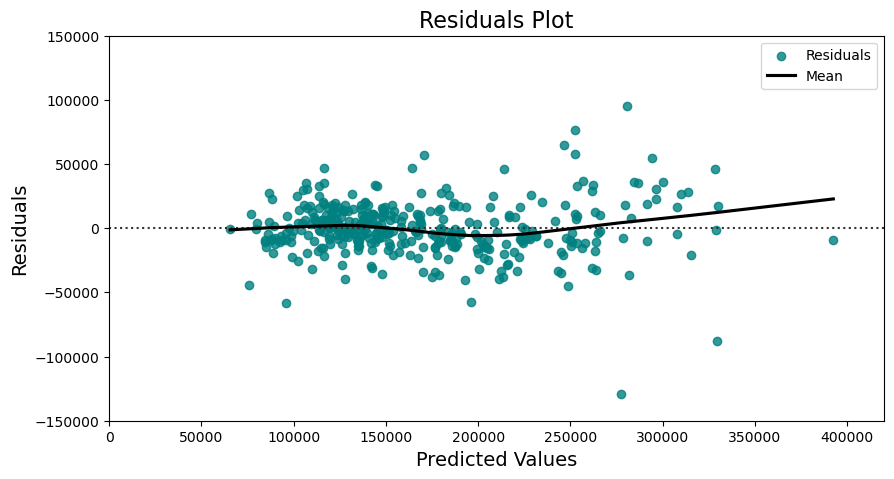
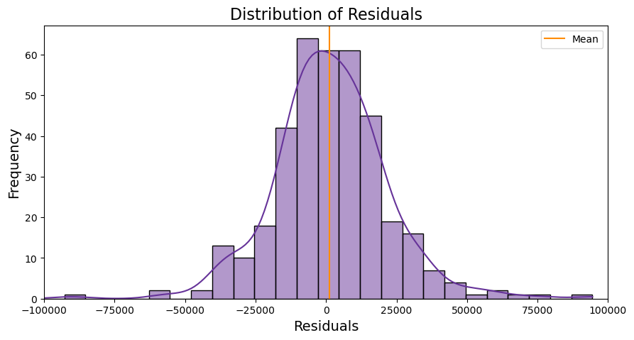
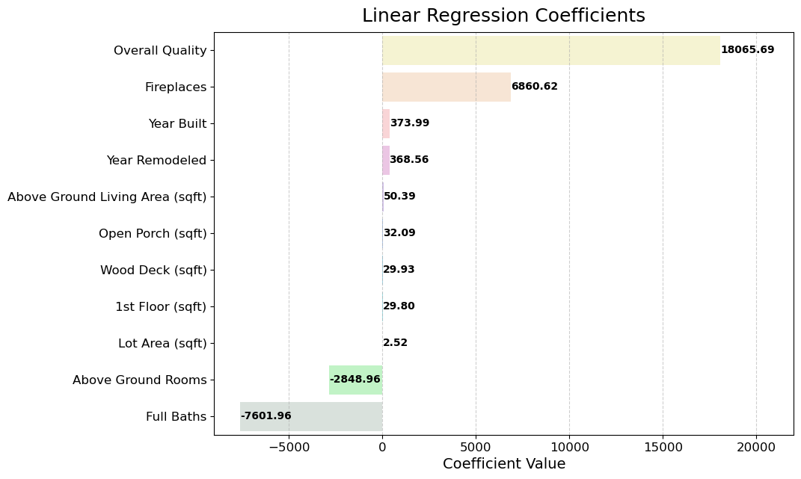
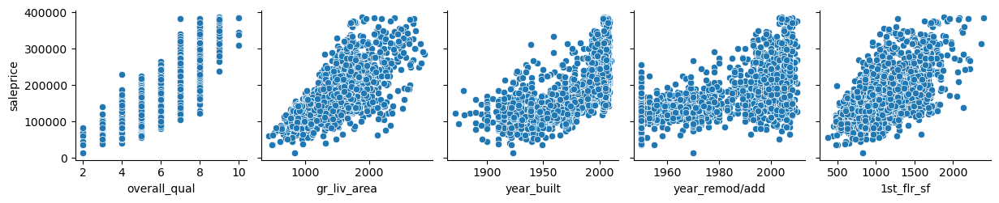
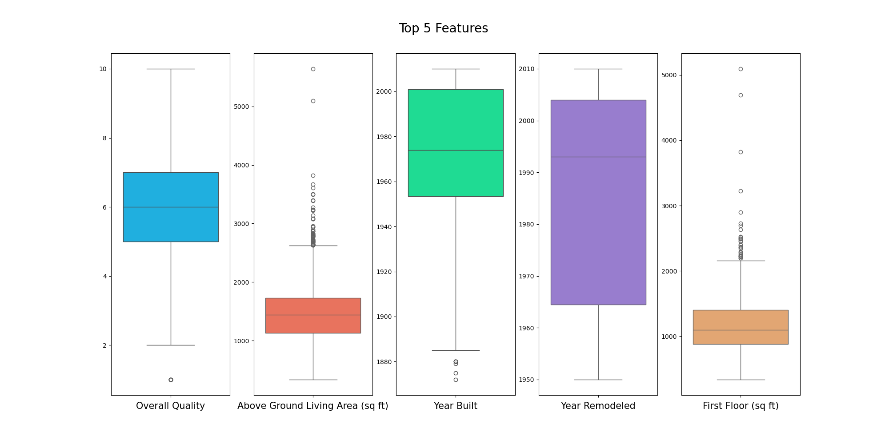
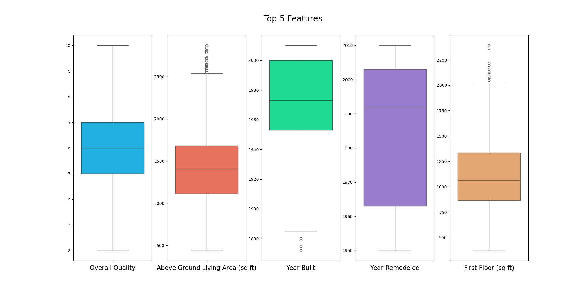

# Housing Data Analysis in Ames, Iowa

## Problem Statement

After recently moving, I started working for a home construction company located in Ames, Iowa. The company is looking to identify the key factors that affect housing prices so they can build new homes that meet market demands and are priced competitively. They have tasked me with analyzing the data they provided and reporting my findings so they can begin construction. Additionally, the company has expressed their need for me to develop a model which can be applied to other datasets from surrounding cities.

## Data

I worked with two datasets: 'train.csv' and 'test.csv,' both comprising of 81 features describing various home characteristics. It's worth noting that 'test.csv' does not include the 'SalePrice' column, which serves as the target variable for the features.

### Data Dictionary

A data dictionary is provided <ins>[Here](./datasets/DataDictionary_AmesIowa.txt)</ins>

## Data Cleaning and Exploratory Data Analysis

First, I addressed missing values by removing columns containing null values, resulting in a cleaner dataset with 28 columns. Following this, I standardized the column names by replacing spaces with underscores and converting them to lowercase. The refined datasets were saved as 'cleaned_test.csv' and 'cleaned_train.csv.'

Key findings from the analysis include:

-   The average 1st-floor square footage is 1116, whereas the average above-ground living area is 1436 sq ft.
-   48% of homes in the dataset feature a fireplace.
-   On average, homes have a deck size of 84 sq ft.
-   The average sale price for the homes in the dataset is $171,000.

I identified significant correlations between several variables and sale price. To enhance model performance, I conducted a careful selection process, sorting and excluding columns with a correlation less than 0.30.

Columns with a correlation greater than 0.29 emerge as the most influential features for the model, consistently yielding the highest scores.

To refine the dataset, I conducted outlier removal by excluding data beyond the 20th and 80th percentiles. This resulted in the removal of approximately 200 rows, accounting for about 10% of the data. This process had a positive impact, further enhancing the correlation and improving the model fit.

Model scores:

-   Linear Regression: Average Cross Val Score of 0.845, R2 Score of 0.850.
-   Polynomial Regression: Average Cross Val Score of 0.876, R2 Score of 0.880.
-   Ridge Regression: Average Cross Val Score of 0.873, R2 Score of 0.880.
-   Lasso Regression: Average Cross Val Score of 0.873, R2 Score of 0.882.

After careful evaluation, I selected Lasso Regression as the final model. It demonstrated superior accuracy, achieving an 88% precision in its predictions. Using this model, I can predict sale price with an approximate margin of $42,000.

### **Residuals Plot**

### **The residuals exhibit a normal distribution**

## Conclusions

I am pleased to present the optimal variables and model for addressing the problem. This model is now ready for testing on additional data from surrounding cities.

The key features influencing my model include:

-   Overall Quality
-   Above Ground Living Area sq ft
-   Year Built
-   First Floor sq ft
-   Year Remodeled
-   Full Baths
-   Fireplaces
-   Rooms Above Ground
-   Open Porch sq ft
-   Lot Area sq ft
-   Wood Deck sq ft

The selection of these features is based on their correlation to 'Sale Price.' After rigorous trial and error, I identified these 11 features as contributors to the most predictive model. It's noteworthy that all the chosen features exhibit a correlation exceeding 0.30, as demonstrated below.

| Feature        | Correlation |
| :------------- | :---------: |
| overall_qual   |    0.810    |
| gr_liv_area    |    0.694    |
| year_built     |    0.633    |
| year_remod/add |    0.587    |
| 1st_flr_sf     |    0.585    |
| full_bath      |    0.552    |
| fireplaces     |    0.448    |
| totrms_abvgrd  |    0.446    |
| open_porch_sf  |    0.393    |
| lot_area       |    0.355    |
| wood_deck_sf   |    0.320    |

While these features contribute to predicting the sale price, not all of them lead to an increase in sale price. Extracting coefficients from the model is helpful in describing the relationship between the features and the sale price. The plotted coefficients aid in the interpretation.

Holding all else constant,

-   For every 1-unit increase in Overall Quality, Sale Price increases by $18065.69
-   For every 1-unit increase in Fireplaces, Sale Price increases by $6860.62

The newer and nicer the home, the higher the sale price is expected to be.

## Recommendations

I recommend that the company focus on the construction of high-quality, new homes featuring a spacious design. Specifically, the target size for these homes should range from 1400 to 1700 square feet. Emphasis should be placed on keeping most of the square footage on the 1st floor, and each home should include 2 full baths and a fireplace to address cold winters. Additionally, incorporating a porch or wooden deck is advisable, as many Ames homes tend to have these features.

By adhering to these guidelines and maintaining a price range between $150,000 and $180,000, we can offer buyers affordable yet quality homes with the features they'll appreciate.

## Additional Visuals

### **Scatterplot of Correlations Between Sale Price and Top 5 Features**

### **Boxplots of the Top 5 Features Before Outlier Removal**

### **Boxplots of the Top 5 Features After Outlier Removal**

# Improvements

This model can be improved further. For example, instead of dropping all columns that contain null values, drop columns where more than 20% of values are missing. Then we can fill missing the values of the other columns using SimpleImputer, OneHotEncoder and ColumnTransformer. This model only contains features with a positive correlation of .30. If we can fix more columns in the dataset then we should have more features perhaps even with a negative correlation less than -0.30 which will provide a more predictive model.
